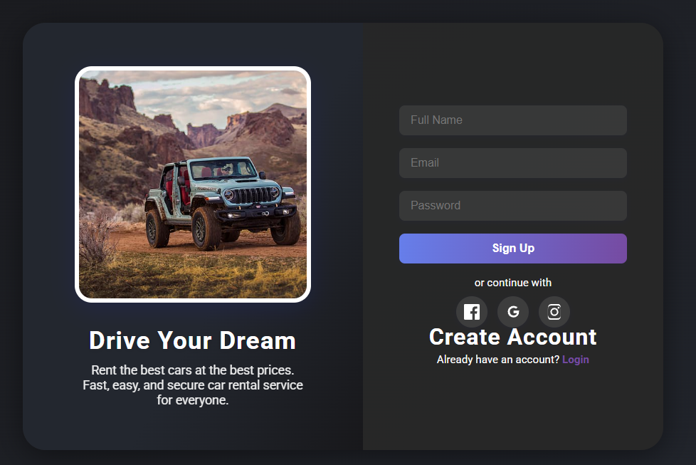

# Car Rental Login & Signup Page

This project features a modern, animated login and signup page designed for a car rental service. It uses HTML and CSS for a clean, glassmorphism-inspired UI, with smooth transitions and social login options.

## Features

- **Animated Login/Signup Toggle:** Seamless transition between login and signup forms.
- **Modern UI:** Glassmorphism effect, rounded corners, and vibrant gradients.
- **Responsive Design:** Looks great on desktop and mobile.
- **Car Image:** Themed image for car rental branding.
- **Social Login:** Continue with Facebook, Google, or Instagram, with interactive hover effects.

## Usage

1. Open `HTML/login.html` in your browser.
2. Try toggling between login and signup.
3. Test the social login buttons and enjoy the animations.

## Screenshot

## Customization

- Replace the car image URL in the HTML for your own branding.
- Adjust colors and fonts in the `<style>` section as needed.

---

**Made for car rental web projects.**